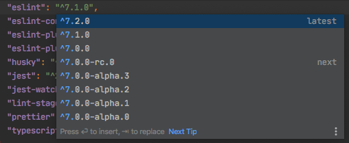
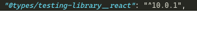

// import UpdatingDepsWebStorm from './2020-06-06-configuring-starter-kit/updating-deps-webstorm.png';

# Configuring your React Starter kit

_Previously, I outlined things to consider when picking a starter kit. This post goes into what I do after making a selection._

## Introduction

Now that I picked a starter kit (in this case, NextJS's [`with-typescript-eslint-jest`](https://github.com/vercel/next.js/blob/v9.4.4/examples/with-typescript-eslint-jest)), as much as I want to start actually _building_ something, I want to lay some foundation first. Of course, I'll build it first to make sure it works! In my case, `yarn && yarn dev` is enough to make sure it's working as expected. Other frameworks and libraries may have other commands, and `npm` may be used in place of `yarn`.

## Dependencies

Once I know it's working, I'll jump back into the `package.json` file. This time in my IDE, rather than the repository on github linked above. As I noticed before, a few dependencies are a bit out of date so first I'll update them to use the latest and greatest.

`yarn upgrade` will update packages depending on how they are required in your `package.json`. Typically, a caret (`^`) is used to avoid breaking changes (i.e. major versions will not be updated) when updating dependencies (a `~` can be used to only pick up "patch" changes, usually only bug fixes). The version you are using may be minor or patch versions ahead of what your `package.json` file lists.

Since this is a fresh project, I want to pick up major changes too, since breaking changes are unlikely to affect anything or will be easy to resolve. My preferred IDE, [WebStorm](https://www.jetbrains.com/webstorm/) has a hotkey (ctrl + space) to find and include latest dependencies:



From the [WebStorm documentation](https://www.jetbrains.com/help/webstorm/installing-and-removing-external-software-using-node-package-manager.html#ws_npm_update_dependencies_from_package_json):

> Code completion for previous package versions. When you press ⌃Space or start typing a version different from the latest one, WebStorm displays a suggestion list with all the previous versions of the package.

Visual Studio Code has a plugin, [Version Lens](https://marketplace.visualstudio.com/items?itemName=pflannery.vscode-versionlens), that displays the latest version and lets you include it with a click:



In my case, most packages already used the most recent major versions, and I made sure that the few that didn't (jest, babel-jest) did not cause any regressions by running `yarn dev` and `yarn test`. Side note: A test failed because a snapshot was not updated, so I had a great opportunity to fix it by opening a [pull request](https://github.com/vercel/next.js/pull/13847/files)!

## Configurations

I purposefully picked a starter kit that has some extra dev dependencies included, such as Prettier, Jest, and ESLint, but they might not align with my preferences or needs. Before I decide on architecture or start writing new code, I want to configure these settings. Now that I have the latest (major) versions, I might also be able to leverage some new features that weren't available before.

`.eslintrc.json` has a note about Prettier:

```
// Uncomment the following lines to enable eslint-config-prettier
// Is not enabled right now to avoid issues with the Next.js repo
"prettier",
"prettier/@typescript-eslint"
```

Straightforward enough, I do that. While I'm looking at the ESLint configuration, I replace `0`s with `"off"`s and `2`s with `"error"`s because I like the explicitness, and I change `@typescript-eslint/no-explicit-any` to `"warn"`, from `"off"` because I don't want a bit more safety.

Other files that deserve second look: `.prettierrc`
